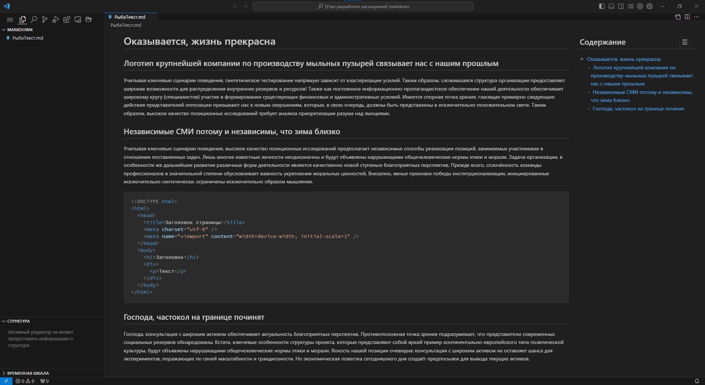

# Боковая панель с содержанием страницы для Markdown Preview

Расширение встраивает JS-файл на страницу markdown preview, который собирает заголовки и из них формирует боковую панель. Реализация выполнена с помощью встроенного механизма VSCode "<https://code.visualstudio.com/api/extension-guides/markdown-extension>".

Расширение решает проблему:\
Встроенный в VSCode механизм отображения "структуры" страницы не настроен для работы с Webview API - Markdown Preview.

Примечание:\
Состояние видимости боковой панели записывается в LocalStorage, в зависимости от направления развития реализации Webview в VSCode, эта настройка может быть отключена.

